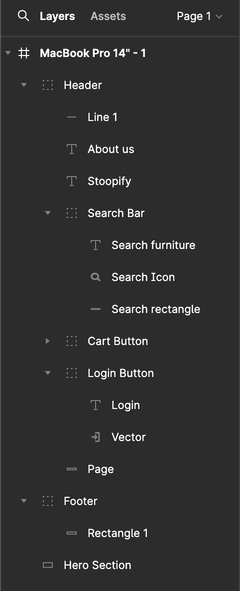

# Prototyping Document

This is a screen capture of our work from the first front end brainstorming session. This was taken on 01-31-24.

We added a header, footer and a hero section.

For header these are the features that were created:

Markup : _ Stoopify Title
_ Search Bar
_ Login Button
_ Cart Button

In Figma, everything was grouoped for accessiblity. Moving forward, we will be following this format when creating other pages.

